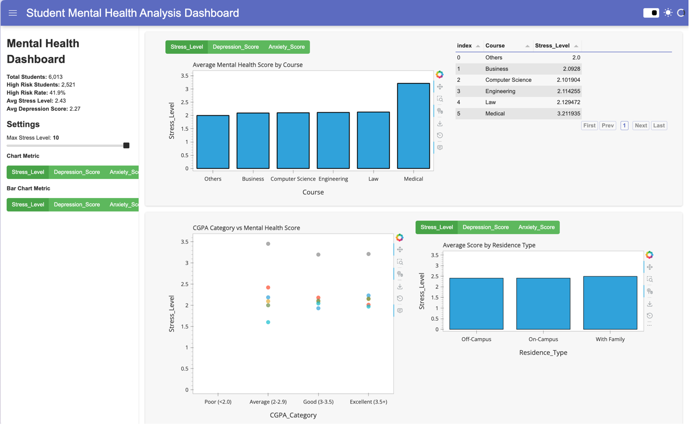

# Student Mental Health Analysis Dashboard



This project analyzes student mental health survey data and builds an interactive dashboard using **Panel** and **hvPlot**.

## Notebook
- `Student_Mental_Health_Dashboard.ipynb`

## Dataset
- `students_mental_health_survey.csv`

## Visualizations
The `image` folder contains various static charts and visualizations related to this project.

## Problem Focus
Mental health issues among university students (stress, anxiety, depression) are increasing. This notebook cleans noisy survey data, derives risk-focused features, and presents interactive visual analysis.

## Notebook Workflow (as implemented)
1. Install libraries (if needed)
2. Import libraries
3. Load dataset
4. Check missing values
5. Data cleaning
6. Feature engineering
7. Basic statistical summary
8. Data visualizations
9. Statistical analysis (hypothesis tests)
10. Cache data for dashboard
11. Panel widgets (dashboard filters)
12. Interactive pipelines (hvplot)
13. Assemble full dashboard with `FastListTemplate`
14. Run instructions

## Dashboard Features
- Interactive stress-level slider filter
- Selectable y-axis metric for trend visualizations
- Selectable metric for residence-type comparison bars
- KPI sidebar showing total students, high-risk count/rate, average stress, and average depression

## Engineered Columns Used in Analysis
- `High_Risk`
- `Mental_Health_Score`
- `Age_Group`
- `CGPA_Category`

## Setup
1. Create a virtual environment
2. Install dependencies from `requirements.txt`

```bash
python -m venv .venv
source .venv/bin/activate
pip install -r requirements.txt
```

## Run Dashboard
From repository root:

```bash
panel serve Student_Mental_Health_Dashboard.ipynb --show
```

Or run all notebook cells in Jupyter and launch with `template.show()`.
